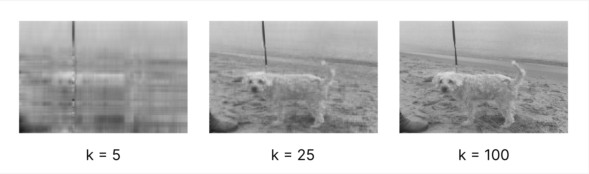

# SVD Image Compression

Compress images using low-rank approximations. A higher *k* will result in better approximations but requires more data to encode the image.



## Usage

```
$ cargo run <path_to_image>
```

Alternately, you can compile the package first and then run the executable:

```
$ cargo build --release
$ ./target/svd-image-compression <path_to_image>
```

Note that large images will take longer to compress.
